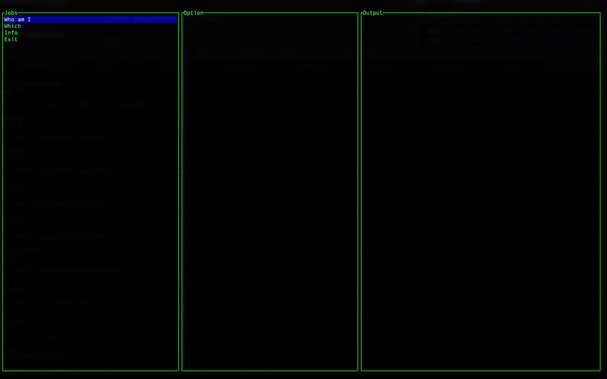

# run

這是一個基于 Rust 的終端應用程序，旨在執行一係列任務，并支持通過不同的操作選項進行交互。應用通過 TUI（文本用户界面）展示任務列表，允許用户選擇任務并執行相應的操作，支持以下功能：
1. 任務管理：應用加載并展示任務列表（包括直接執行任務和帶選項的任務）。用户可以選擇任務并執行。
2. 命令執行：每個任務都與一個命令（如 shell 命令）相關聯，通過 Shell 結構體管理命令的執行。
3. 交互式選擇：對于帶有選項的任務，用户可以選擇不同的選項，應用會根據選中的選項執行相應的命令。
4. 終端界面：通過 TUI 界面展示任務，并實時顯示執行結果。

應用支持：
- 多個平臺：支持在 Linux、macOS 和 Windows 環境下運行。
- 動態更新：任務執行時能够動態更新輸出信息，顯示在終端中。

[EN](./README.md)

## 讚賞

